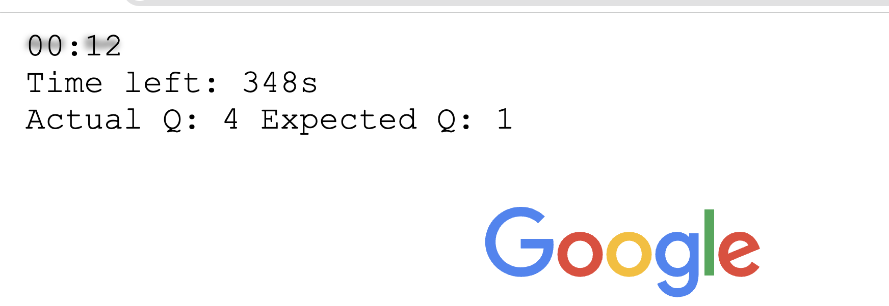

# 🕒 Overlay Timer Extension

A lightweight browser extension that overlays a live timer and question tracker on any webpage. Perfect for online exams, quizzes, or practice sessions where you want to pace yourself and track your progress visually.

---

## ✨ Features

- **Floating Timer Overlay:** Displays elapsed time in a stylish, unobtrusive overlay.
- **Question Tracker:** Tracks both expected and actual question numbers based on your pace.
- **Customizable Timing:** Easily adjust seconds per question.
- **Keyboard Shortcuts:**
  - Press **S** to toggle the overlay on/off.
  - Press **Enter** to increment your actual question count.
- **Smart Contrast:** Overlay text color adapts to your page background for maximum readability.
- **Minimal UI:** Overlay is click-through and never blocks your workflow.

---

## 🚀 Usage

1. **Inject `content.js`** into your desired webpage (via extension or manual script injection).
2. **Press `S`** to show/hide the overlay timer.
3. **Press `Enter`** each time you move to the next question.
4. **Monitor your pace:** The overlay shows:
   - Elapsed time (`mm:ss`)
   - Time left for your current question
   - Actual vs. expected question number

---

## 🛠️ Customization

- **Change seconds per question:**  
  Edit the line in `content.js`:
  ```javascript
  qTracker = new QTracker(90, updateTimer); // 90 seconds per question
  ```
  Replace `90` with your preferred value.

- **Overlay Position & Style:**  
  Tweak the `overlay.style` properties in `createOverlay()` for custom placement or appearance.

---

## 🧩 How It Works

- **QTracker Class:** Handles timing, expected/actual question logic, and state updates.
- **Overlay DOM:** Injects a styled `<div>` at the top-left of the page.
- **Keyboard Listeners:** Listen for `S` and `Enter` to control the overlay and question count.
- **Contrast Detection:** Automatically picks overlay text color for best visibility.

---

## 📦 Installation

1. **As a User Script:**  
   Use [Tampermonkey](https://www.tampermonkey.net/) or similar, and paste the contents of `content.js`.

2. **As a Chrome Extension:**  
   - Create a manifest and include `content.js` as a content script.
   - Load the extension in developer mode.

---

## 🧑‍💻 Code Structure

- `content.js`  
  Main logic for overlay, timer, question tracking, and keyboard controls.

---

## 🖼️ Example



---

## 📝 License

MIT License

---

## 🙏 Credits

Made with ❤️ for students and self-learners